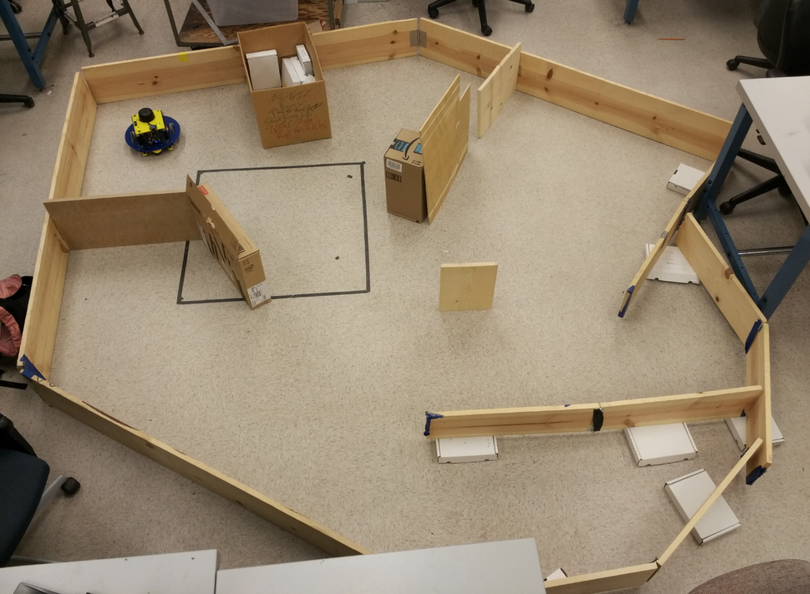
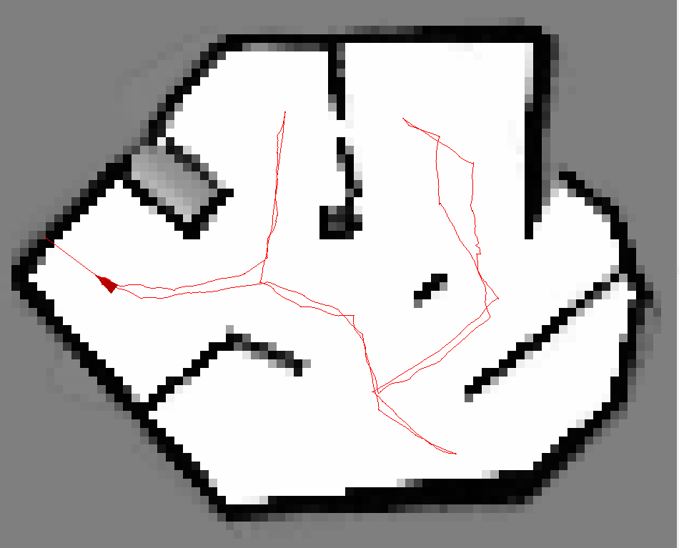

# Simultaneous Localization and Mapping

##### Bahaa Aldeeb, Jeffrey Dominic, Tae Hyun Kim, Zizhao Wang, Yang Zhang

###### (Name in Alphabetical order)

###### University of Michigan, EECS 467 Autonomous Robotics W18, Project 2

The goal of this project is to implement simultaneous mapping and localization (SLAM) algorithms that allow a robot to explore an unfamiliar maze. Using LiDAR and wheel encoder data, we implemented SLAM using particle filtering (Monte Carlo Localization) for sensor fusion and localization, and A* for path planning and exploration. The robustness of the algorithm was proven by successfully exploring a difficult maze.

The following is a video about how the robot explores the maze:

If you want to skip the video, these are the photo of the true maze and the map that the robot gets after exploring the maze along the red route:

  
   

